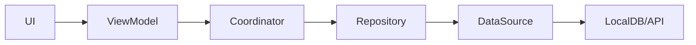

# Sentra

Summary: Mobile-First Field Operations & Inspection Platform  
Project status: Research  
Created by: Subhanu  
Created time: May 14, 2026 8:26 PM  
Last edited time: May 14, 2026 8:38 PM  

## Sentra Knowledge Repository

> Single Source of Truth (SSOT) for all engineering, architecture, product, operational, and implementation decisions related to Sentra.

---

## Overview

Sentra is a production-grade, offline-first, mobile-first field operations platform designed for organizations managing distributed field teams.

### Runtime defaults (important)

- `BYPASS_AUTH` now defaults to `false` when not explicitly set.
- Set `BYPASS_AUTH=true` only for local/mock auth development.
- Sync engine starts independently of bypass mode and drains pending Drift queue entries when connectivity is restored.

The platform enables:

- work order management
- inspection workflows
- asset tracking
- media-rich reporting
- realtime operational coordination

Sentra is engineered for environments with:

- intermittent connectivity
- distributed operations
- reliability-critical workflows
- field-based execution environments

---

## Product Vision

Sentra aims to provide a resilient operational platform that prioritizes:

- reliability under poor network conditions
- operational efficiency
- scalable architecture
- realtime collaboration
- secure multi-tenant infrastructure
- maintainable engineering systems

---

## Core Product Capabilities

| Capability | Description |
| --- | --- |
| Work Orders | Assignment and lifecycle management |
| Inspections | Dynamic forms and validation workflows |
| Asset Tracking | QR-enabled asset operations |
| Offline Synchronization | Local-first resilient synchronization |
| Media Uploads | Background upload infrastructure |
| Realtime Updates | Live operational coordination |
| Analytics | Operational visibility and monitoring |

---

## User Personas

| User Type | Responsibilities |
| --- | --- |
| Technician | Performs field operations and inspections |
| Supervisor | Assigns work and reviews submissions |
| Operations Manager | Monitors workforce and operational metrics |
| Admin | Manages organization-level configuration |

---

## Product Goals

### Primary Goals

- Enable reliable field operations under poor network conditions
- Reduce operational friction for technicians
- Provide structured inspection workflows
- Improve operational visibility for managers
- Ensure secure and scalable multi-tenant operation
- Maintain production-grade engineering standards

---

## High-Level Architecture

```text
Mobile Client (Flutter)
    ↓
Local Database (Drift)
    ↓
Sync Engine
    ↓
Supabase Backend
    ├── PostgreSQL
    ├── Realtime
    ├── Storage
    └── Authentication
```

---

## Architectural Principles

### 1. Feature-First Modular Architecture

All business functionality is isolated by feature module.

```text
features/
  auth/
  work_orders/
  inspections/
  assets/
  uploads/
  dashboard/
```

#### Benefits

- modular scalability
- lower coupling
- isolated testing
- independent feature ownership
- easier onboarding

---

### 2. Clean Architecture

Strict layer separation is enforced within each feature module. Pragmatically, **Coordinators** directly orchestrate state flows between presentation and repositories, avoiding unnecessary forwarding use-cases.



---

### 3. Offline-First Design

The application must remain operational without internet connectivity.

#### Principles

- local database acts as the immediate source of truth
- synchronization occurs asynchronously
- UI updates optimistically
- network failures must not block workflows

---

### 4. Unidirectional Data Flow

```text
UI Input
    ↓
ViewModel
    ↓
Coordinator
    ↓
Repository
    ↓
Data Source
```

State updates flow upward through reactive Riverpod providers.

#### Benefits

- predictability
- easier debugging
- reduced side effects
- testability

---

## Repository Structure

```text
lib/
├── app/
│
├── core/
│   ├── di/
│   ├── env/
│   ├── error/
│   ├── logging/
│   ├── networking/
│   ├── storage/
│   ├── sync/
│   ├── telemetry/
│   ├── connectivity/
│   └── utils/
│
├── shared/
│   ├── widgets/
│   ├── extensions/
│   ├── themes/
│   └── constants/
│
├── routes/
│
├── features/
│   ├── auth/
│   │   ├── presentation/
│   │   ├── application/
│   │   ├── domain/
│   │   └── data/
│   │
│   ├── work_orders/
│   ├── inspections/
│   ├── assets/
│   ├── uploads/
│   └── dashboard/
│
├── app.dart
└── main.dart
```

---

## Layer Responsibilities

### Presentation Layer

#### Responsibilities

- rendering UI
- handling user interaction
- managing UI state
- observing reactive state providers

#### Technologies

- Flutter
- Riverpod 3 (`AsyncNotifierProvider.autoDispose`, `AsyncNotifier`)
- `AsyncValue`

#### Rules

##### MUST

- remain UI-focused
- use immutable state
- delegate business logic to coordinators/viewmodels

##### MUST NOT

- call APIs directly
- access databases directly
- contain business logic
- perform workflow orchestration

---

### Application Layer

#### Responsibilities

Coordinates workflows spanning multiple systems or logic boundaries using feature **Coordinators**.

#### Examples

- login orchestration
- sync coordination
- upload scheduling
- transactional operations

#### Purpose

Prevents:

- bloated ViewModels
- repository coupling
- duplicated orchestration logic

---

### Domain Layer

#### Responsibilities

Contains pure business logic and abstract definitions.

#### Includes

- entities
- repository contracts
- domain failures

#### Rules

##### MUST

- remain framework-independent
- be deterministic and testable

##### MUST NOT

- depend on Flutter UI elements
- depend on external networking SDKs
- depend on concrete database implementations

---

### Data Layer

#### Responsibilities

Handles:

- remote APIs
- local persistence
- DTOs
- serialization
- caching
- concrete repository implementations

#### Includes

```text
data/
├── datasources/
├── repositories/
├── models/
└── mappers/
```

---

### Core Layer

#### Responsibilities

Cross-cutting foundational infrastructure.

#### Includes

- logging
- dependency injection
- sync engine
- telemetry
- connectivity handling
- networking
- storage abstractions

---

## Technology Stack

| Concern | Technology |
| --- | --- |
| Mobile App | Flutter |
| State Management | Riverpod 3 |
| Routing | AutoRoute v11.x |
| Local Database | Drift |
| Backend | Supabase |
| Authentication | Supabase Auth |
| Storage | Supabase Storage |
| Dependency Injection | GetIt + Injectable |
| Functional Error Handling | fpdart |
| Analytics | PostHog |
| Error Monitoring | Sentry |
| Logging | logger |

---

## Dependency Injection

### Purpose

Centralized compile-time dependency management for:

- scalability
- testability
- modular registration
- lifecycle management

### Injection Bootstrap

```dart
final getIt = GetIt.instance;

@InjectableInit()
Future<void> configureDependencies() async {
  await getIt.init();
}
```

### RegisterModule Example

```dart
@module
abstract class RegisterModule {
  @lazySingleton
  AuthApiClient get authApiClient => AuthApiClient.create();

  @preResolve
  Future<SharedPreferences> get prefs =>
      SharedPreferences.getInstance();
}
```

---

## Networking Architecture

### Flow

```text
Repository
    ↓
RemoteDataSource
    ↓
API Client
    ↓
Supabase/API
```

### Networking Responsibilities

The networking layer handles:

- authentication refresh
- request retries
- interceptors
- request tracing
- telemetry
- timeout handling
- structured API failures

---

## Error Handling Strategy

### Principles

Avoid generic exceptions. Use strongly typed, sealed failures.

### Failure Hierarchy

```dart
sealed class Failure {
  final String message;
  const Failure(this.message);
}

class NetworkFailure extends Failure {
  const NetworkFailure([super.message = 'Network connection failed.']);
}

class AuthFailure extends Failure {
  const AuthFailure([super.message = 'Authentication failed.']);
}

class ValidationFailure extends Failure {
  const ValidationFailure([super.message = 'Invalid input data.']);
}

class CacheFailure extends Failure {
  const CacheFailure([super.message = 'Local cache access failed.']);
}

class SyncConflictFailure extends Failure {
  const SyncConflictFailure([super.message = 'Data synchronization conflict detected.']);
}

class UploadFailure extends Failure {
  const UploadFailure([super.message = 'Media or data upload failed.']);
}
```

### Functional Error Handling

Use functional structures for predictable flow control:

```dart
Either<Failure, T>
```

for all repository responses.

#### Benefits

- explicit failure handling
- predictable async behavior
- safer state transitions
- easier testing

---

## Local Persistence

### Why Drift

Sentra requires:

- relational queries
- transactional writes
- sync metadata
- complex local caching
- efficient pagination

Drift is preferred over lightweight KV stores for complex domain schemas.

### Core Tables

```sql
users
organizations
work_orders
work_order_comments
assets
inspection_templates
inspection_fields
inspection_submissions
attachments
sync_queue
notifications
```

---

## Offline Synchronization System

### Purpose

The application must remain fully operational under intermittent or unavailable network conditions.

### Sync Engine Responsibilities

Located in:

```text
core/sync/
```

Handles:

- mutation queues
- retries
- connectivity awareness
- conflict resolution
- optimistic updates
- synchronization scheduling

### Synchronization Flow

```text
User Action
→ Local Database Write
→ Queue Mutation
→ Immediate UI Update
→ Background Sync
→ Server Acknowledgement
→ Sync State Update
```

### Synchronization States

```text
PENDING
SYNCING
SYNCED
FAILED
CONFLICT
```

### Conflict Resolution Strategy

#### Initial Strategy

- timestamp reconciliation
- server-wins fallback

#### Future Enhancements

- merge strategies
- collaborative conflict handling
- manual conflict review tools

---

## Realtime Architecture

### Technologies

- Supabase Realtime
- Riverpod reactive subscription streams

### Realtime Features

- live work-order updates
- assignment notifications
- inspection completion events
- operational synchronization

---

## State Management

### Recommended Pattern

Feature ViewModels implement Riverpod 3 asynchronous state management:

```dart
AsyncNotifierProvider.autoDispose
```

### State Management Principles

Use:

- `AsyncValue` / `AsyncNotifier`
- immutable state models
- sealed state objects
- reactive providers

Avoid:

- mutable shared state
- business logic inside UI widgets
- tightly coupled provider graphs

### Example Provider

```dart
final authViewModelProvider =
    AsyncNotifierProvider.autoDispose<AuthViewModel, User?>(() {
  return AuthViewModel();
});
```

---

## Navigation

### Routing Package

Uses **AutoRoute** v11.x for static and dynamic routing schemas.

### Why AutoRoute

- strongly typed routes
- nested tab navigation support (`AutoTabsRouter`)
- navigation route guards (`AuthGuard`)
- scalable code-generated routes

### Example Routing Call

```dart
context.router.push(WorkOrdersRoute());
```

---

## Authentication Module

### Auth Features

- email/password authentication
- persistent device sessions
- secure token refreshing
- multi-device synchronization support
- role-based authorization rules

### Auth Functional Requirements

| ID | Requirement |
| --- | --- |
| AUTH-001 | Users shall authenticate using email/password credentials |
| AUTH-002 | The system shall securely persist sessions locally |
| AUTH-003 | The system shall refresh expired access tokens automatically |
| AUTH-004 | The system shall enforce role-based access control |
| AUTH-005 | Unauthorized users shall be routed via protected route guards |

---

## Work Order Management

### Work Order Features

- create work orders
- assign technicians
- state lifecycle transitions
- priority leveling
- comments and field notes
- media attachments

### Work Order Lifecycle

```text
OPEN
→ ASSIGNED
→ IN_PROGRESS
→ ON_HOLD
→ COMPLETED
→ VERIFIED
```

### Work Order Functional Requirements

| ID | Requirement |
| --- | --- |
| WO-001 | Supervisors shall create work orders |
| WO-002 | Supervisors shall assign technicians |
| WO-003 | Technicians shall update work order status |
| WO-004 | The system shall maintain status transition history |
| WO-005 | Users shall attach media files to work orders |
| WO-006 | Work orders shall support comments and notes |

---

## Inspection Module

### Inspection Features

- dynamic inspection templates
- conditional input fields
- structural validation rules
- media verification evidence
- background submission tracking

### Inspection Functional Requirements

| ID | Requirement |
| --- | --- |
| INS-001 | Admins shall create inspection templates |
| INS-002 | Templates shall support multiple field types |
| INS-003 | Templates shall support validation rules |
| INS-004 | Mobile clients shall render forms dynamically |
| INS-005 | Technicians shall submit completed inspections |
| INS-006 | Inspection submissions shall support media uploads |

---

## Asset Management

### Asset Features

- equipment registration
- lifecycle maintenance logs
- device camera QR code scanning
- operational history timelines

### Asset Functional Requirements

| ID | Requirement |
| --- | --- |
| AST-001 | The system shall maintain asset records |
| AST-002 | Assets shall support unique QR identifiers |
| AST-003 | Technicians shall scan assets using device cameras |
| AST-004 | The system shall track maintenance history |

---

## Media Upload System

### Media Upload Features

- background upload queues
- automatic compression
- connection drop recovery retries
- byte-level progress reporting

### Media Upload Functional Requirements

| ID | Requirement |
| --- | --- |
| MED-001 | Users shall upload images and documents |
| MED-002 | Uploads shall continue in the background |
| MED-003 | Failed uploads shall retry automatically |
| MED-004 | Media shall be compressed before upload |
| MED-005 | Upload progress shall be visible to users |

---

## Realtime Communication

### Realtime Features Overview

- live operational task distribution
- online presence verification
- instant alert dispatches

### Realtime Functional Requirements

| ID | Requirement |
| --- | --- |
| RT-001 | Clients shall receive realtime work order updates |
| RT-002 | Supervisors shall receive inspection completion events |
| RT-003 | Technicians shall receive assignment notifications |

---

## Performance Requirements

| ID | Requirement |
| --- | --- |
| PERF-001 | Cold app startup time shall remain below 3 seconds |
| PERF-002 | UI interactions shall maintain 60 FPS |
| PERF-003 | Work order lists shall paginate efficiently |
| PERF-004 | Media uploads shall support background execution |

---

## Reliability Requirements

| ID | Requirement |
| --- | --- |
| REL-001 | Application shall tolerate intermittent network failures |
| REL-002 | No user-generated data shall be lost during connectivity interruptions |
| REL-003 | Failed sync operations shall retry automatically |

---

## Security Requirements

| ID | Requirement |
| --- | --- |
| SEC-001 | All network traffic shall use HTTPS |
| SEC-002 | Authentication tokens shall be stored securely |
| SEC-003 | Row-level security policies shall isolate tenant data |
| SEC-004 | Role-based access shall be enforced server-side |

---

## Scalability Requirements

| ID | Requirement |
| --- | --- |
| SCALE-001 | System shall support multi-tenant organizations |
| SCALE-002 | Backend shall scale horizontally using Supabase infrastructure |
| SCALE-003 | Realtime subscriptions shall support concurrent users |

---

## UI/UX Principles

The application UI shall prioritize:

- operational efficiency
- high information density
- rapid task completion
- responsive interaction patterns

### Design Characteristics

- minimalistic enterprise styling
- dark-mode optimized interface
- accessible typography
- consistent interaction patterns
- keyboard accessibility for tablets/desktops

---

## Testing Strategy

| Layer | Type | Tool |
| --- | --- | --- |
| ViewModels | Unit | flutter_test |
| Coordinators | Unit | mocktail |
| Repositories | Integration | mocktail |
| Sync Engine | Integration | flutter_test |
| UI | Widget | flutter_test |

---

## Observability

### Logging

Use:

- structured logs
- scoped tags
- contextual metadata

### Error Monitoring

Use:

- Sentry Flutter SDK

Enabled only in:

- staging
- production

### Analytics Tracking

Use:

- PostHog

Track:

- sync failures
- upload success rates
- screen usage
- workflow completion
- operational metrics

---

## Architectural Anti-Patterns

Avoid:

- business logic inside widgets
- repositories calling widgets
- generic failure messages
- unnecessary abstractions
- interfaces with meaningless implementations
- use cases that only forward calls (use feature Coordinators directly)

Architecture should remain:

- intentional
- pragmatic
- maintainable

---

## Engineering Guidelines

- Keep domain entities framework-agnostic
- Separate DTOs from entities
- Prefer immutable state
- Use optimistic updates
- Keep sync logic centralized
- Build feature modules independently
- Instrument critical workflows
- Prioritize reliability over abstraction purity

---

## Integrated Services

| Service | Purpose |
| --- | --- |
| Supabase | Backend infrastructure |
| Sentry | Error monitoring |
| PostHog | Product analytics |

---

## Future Enhancements

### Planned Extensions

- push notifications
- geofencing support
- route optimization
- digital signatures
- web admin dashboard
- advanced analytics
- audit reporting

---

## Success Metrics

| Metric | Target |
| --- | --- |
| Crash-free sessions | > 99.5% |
| Sync success rate | > 98% |
| Cold start time | < 3s |
| Upload retry recovery success | > 95% |
| Offline workflow coverage | Full critical workflow support |

---

## Developer Guidelines

### Code Quality Standards

#### All code must

- follow feature boundaries
- remain testable
- avoid unnecessary abstraction
- maintain strict layer separation
- use typed failures
- use immutable state

---

## Naming Conventions

| Component | Convention |
| --- | --- |
| ViewModels | `SomethingViewModel` |
| Coordinators | `SomethingCoordinator` |
| Repositories | `SomethingRepository` |
| DTOs | `SomethingDto` |
| Providers | `somethingProvider` |

---

## Pull Request Standards

Every PR should include:

- clear scope
- screenshots/videos for UI changes
- testing notes
- migration notes if required
- architecture impact notes if applicable

---

## Deployment Environments

| Environment | Purpose |
| --- | --- |
| Development | Local engineering |
| Staging | QA and validation |
| Production | Live deployment |

---

## Release Principles

Releases must prioritize:

- stability
- rollback safety
- observability
- migration compatibility

---

## Documentation Principles

This repository acts as the authoritative reference for:

- architecture decisions
- engineering standards
- feature requirements
- operational workflows
- implementation guidelines

All major engineering decisions must be documented here before implementation.

---

## Conclusion

Sentra is designed as a resilient, production-grade field operations platform emphasizing:

- offline reliability
- operational efficiency
- scalable architecture
- realtime coordination
- maintainable engineering systems
- enterprise-grade workflow management

The architecture and engineering decisions prioritize:

- maintainability
- reliability
- scalability
- production readiness
- long-term operational sustainability

---

## Resources

- [Flutter Architecture Guide](https://docs.flutter.dev/app-architecture)
- [Riverpod Documentation](https://riverpod.dev/docs/introduction/getting_started)
- [Drift Documentation](https://drift.simonbinder.eu/)
- [AutoRoute Documentation](https://pub.dev/packages/auto_route)
- [Injectable Documentation](https://pub.dev/packages/injectable)
- [fpdart Documentation](https://pub.dev/packages/fpdart)
- [Supabase Documentation](https://supabase.com/docs/guides/getting-started/quickstarts/flutter)
